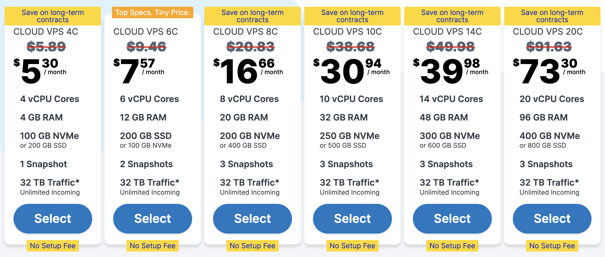

# 🚀 Contabo VPS Review - Contabo vs UpCloud

If you're planning to migrate your website to a VPS, **Contabo** is one of the most budget-friendly options you’ll come across. But does it live up to the hype? And how does it compare to premium providers like **UpCloud**?

In this Contabo review, I’ll share my hands-on experience with Contabo, its features, pricing, and how it stacks up against UpCloud — so you can make an informed decision before moving your WordPress or web project to a new server.

➡️ **Tutorial Included:** Learn how to migrate your WordPress site using SSH + WGET:  
- 👉 [Complete Migration Guide using Contabo](https://github.com/vashishthakapoor/website-migrate)
- 👉 [Get Contabo VPS →](https://vashishthakapoor.com/website-migrate-contabo) 

---

## 🏷️ Overview of Contabo

**Contabo** is a German hosting company known for offering **high-resource VPS plans at extremely competitive prices**. Whether you’re a blogger, developer, or agency, Contabo provides a scalable infrastructure at a cost that’s hard to beat.

### 🔧 Key Features

- Generous specs (RAM, vCPU, and storage)
- SSD or NVMe storage options
- Global data centers (including India, US, UK, Germany, and more)
- Optional DDoS protection
- Support for popular OS templates (Ubuntu, Debian, CentOS, etc.)
- Add-on options like cPanel, Plesk, and additional backups

---

## 💰 Contabo VPS Pricing

## 💰 Contabo Cloud VPS Pricing (2024)

| **Plan**           | **Price/mo** | **vCPU Cores** | **RAM** | **Storage**                            | **Snapshots** | **Traffic**               | **Setup Fee** |
|--------------------|--------------|----------------|---------|----------------------------------------|----------------|---------------------------|---------------|
| Cloud VPS 4C       | $5.30        | 4              | 4 GB    | 100 GB NVMe or 200 GB SSD              | 1              | 32 TB (Unlimited Incoming) | No Setup Fee  |
| Cloud VPS 6C       | $7.57        | 6              | 12 GB   | 200 GB SSD or 100 GB NVMe              | 2              | 32 TB (Unlimited Incoming) | No Setup Fee  |
| Cloud VPS 8C       | $16.66       | 8              | 20 GB   | 200 GB NVMe or 400 GB SSD              | 3              | 32 TB (Unlimited Incoming) | No Setup Fee  |
| Cloud VPS 10C      | $30.94       | 10             | 32 GB   | 250 GB NVMe or 500 GB SSD              | 3              | 32 TB (Unlimited Incoming) | No Setup Fee  |
| Cloud VPS 14C      | $39.98       | 14             | 48 GB   | 300 GB NVMe or 600 GB SSD              | 3              | 32 TB (Unlimited Incoming) | No Setup Fee  |
| Cloud VPS 20C      | $73.30       | 20             | 96 GB   | 400 GB NVMe or 800 GB SSD              | 3              | 32 TB (Unlimited Incoming) | No Setup Fee  |

## 💰 Contabo Cloud VPS Plans (Side-by-Side Comparison)

| Feature             | Cloud VPS 4C     | Cloud VPS 6C     | Cloud VPS 8C     | Cloud VPS 10C    | Cloud VPS 14C    | Cloud VPS 20C    |
|---------------------|------------------|------------------|------------------|------------------|------------------|------------------|
| **Price/month**     | $5.30            | $7.57            | $16.66           | $30.94           | $39.98           | $73.30           |
| **vCPU Cores**      | 4                | 6                | 8                | 10               | 14               | 20               |
| **RAM**             | 4 GB             | 12 GB            | 20 GB            | 32 GB            | 48 GB            | 96 GB            |
| **NVMe Storage**    | 100 GB           | 100 GB           | 200 GB           | 250 GB           | 300 GB           | 400 GB           |
| **SSD Storage**     | 200 GB           | 200 GB           | 400 GB           | 500 GB           | 600 GB           | 800 GB           |
| **Snapshots**       | 1                | 2                | 3                | 3                | 3                | 3                |
| **Setup Fee**       | No               | No               | No               | No               | No               | No               |

> **1** You can choose between SSD or NVMe Storage.
> **2** In all the plans, you get **32 TB Bandwidth with Unlimited incoming traffic**.
> 💡 You can also opt for SSD versions and get even more storage at the same price.

---

## 🌍 Global Infrastructure

Contabo has expanded significantly over the years, offering data centers in:

- 🇮🇳 **India**
- 🇺🇸 **USA** (East & West Coast)
- 🇩🇪 **Germany**
- 🇬🇧 **United Kingdom**
- 🇸🇬 **Singapore**
- 🇯🇵 **Japan**
- 🇦🇺 **Australia**

This global reach ensures **better performance** and **low latency** for your users, no matter where they are.

---

## 🚀 Performance

While Contabo is not known for top-tier IOPS like UpCloud, the performance is **very reliable for web hosting, WordPress, email servers, and basic dev setups**.

- **Network speed:** Stable and sufficient for most use-cases
- **CPU performance:** Consistent, especially for long-running web apps
- **Disk performance:** NVMe helps with faster read/write, suitable for large WordPress sites

---

## 🧩 Use Cases

Contabo is great for:

- Hosting large WordPress sites
- Running WooCommerce stores
- Self-hosted SaaS projects (CRM, LMS, Analytics, etc.)
- Email servers (Postfix, Mailcow, etc.)
- Web development & staging environments
- Hosting frameworks like:
  - ⚙️ **Laravel**
  - 🟢 **Node.js**
  - 🐍 **Django / Flask**
  - 🐘 **PHP / LAMP / LEMP stacks**
- Hosting custom APIs and backends
- Game servers (Minecraft, CS:GO, Valheim, FiveM, etc.)
- Remote Desktop Protocol (RDP) for virtual desktops
- VPN servers (OpenVPN, WireGuard)
- File servers or media streaming (Plex, Jellyfin, Nextcloud)
- Running containerized apps (Docker, Portainer)
- Learning and experimenting with Linux system administration
- Hosting control panels (CyberPanel, cPanel, Plesk, etc.)

> 💡 Whether you're a developer, gamer, business owner, or hobbyist — Contabo’s flexible VPS plans can be tailored for nearly **any use case**.

---

## 🔄 Comparison: Contabo vs UpCloud

| **Feature**                | **Contabo**                                 | **UpCloud**                                 |
|---------------------------|---------------------------------------------|---------------------------------------------|
| **Starting Price**        | €4.49/month                                 | $7.00+/month                                |
| **vCPU (Entry Plan)**     | 4 cores                                     | 1 core                                      |
| **RAM**                   | 8 GB                                        | 1 GB                                        |
| **Storage**               | 50 GB NVMe                                  | 25 GB MaxIOPS                               |
| **Data Centers in India** | ✅ Yes                                      | ❌ No                                        |
| **Storage Performance**   | Good (NVMe or SSD)                          | Excellent (MaxIOPS)                         |
| **Support Response**      | Standard                                    | Very Fast (Avg. <1 minute)                 |
| **Billing**               | Monthly or annual                           | Hourly + Monthly                            |
| **Advanced Tools**        | Basic options                               | Advanced: API, Terraform, CLI               |
| **Best For**              | WordPress, SMB, hosting clients             | Developers, IOPS-heavy apps, quick scaling  |

### 🏁 Verdict

- If you're **budget-conscious** and want maximum resources for hosting or client sites, **Contabo is unbeatable**.
- If you prioritize **maximum I/O speed**, advanced DevOps tools, or need hourly scaling, **UpCloud is the better fit**.

---

## 🔐 Is Contabo Secure?

Contabo offers standard security features such as:
- Free DDoS protection
- SSH access
- Optional firewall setups
- Backup solutions at affordable pricing

While it’s not focused on enterprise-level zero-trust models, it’s **reliable and secure enough for production workloads** with the right configuration.

---

## 📦 Installation Stack Support

You can install:
- WordPress
- LAMP/LEMP stacks
- Docker
- Node.js, Laravel, Django
- Email servers, control panels (CyberPanel, cPanel, etc.)

And much more via SSH or automation tools like WordOps.

---

## 📽️ Must-Watch: WordPress VPS Migration Tutorial

If you're planning to move your WordPress site to a Contabo VPS, don't miss this step-by-step tutorial:

👉 **[How to Migrate WordPress to Contabo VPS using SSH + WGET](https://github.com/vashishthakapoor/website-migrate)**  

This guide shows you how to:
- Skip local file downloads
- Transfer files directly via SSH
- Restore your website in minutes

---

## 🔗 Final Thoughts

Contabo has earned its reputation for being a **cost-effective VPS provider** with solid infrastructure and massive resource allocations. It’s not the fastest out there, but it **delivers unbeatable value**, especially for developers, WordPress users, and freelancers hosting client sites.

If you're just starting with VPS or looking for a high-spec server without burning a hole in your pocket — **Contabo is definitely worth trying**.

---

## 🔗 Affiliate Links (Support the Work)

If this review helped you, consider using the links below. It supports the channel at no extra cost to you 🙏

- 🟢 [Get Contabo VPS →](https://vashishthakapoor.com/website-migrate-contabo)  
- 🔵 [Try UpCloud (with promo) →](https://signup.upcloud.com/?promo=3M623W)

---

*Have questions? Feel free to open an issue or drop a comment on [my blog](https://vashishthakapoor.com).*  
