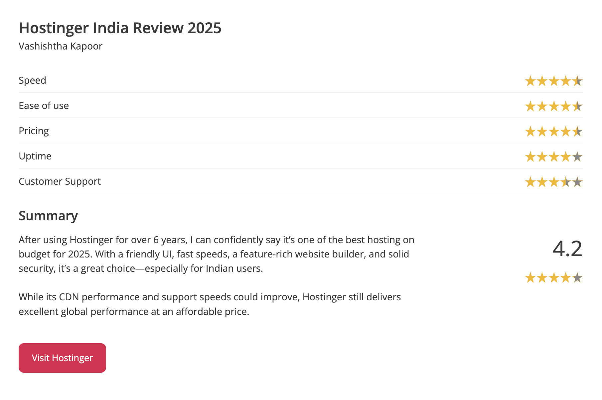

# Hostinger Review 2025: Affordable, Fast & Beginner-Friendly Shared Hosting

**Hostinger** has rapidly become one of the most trusted and widely used web hosting providers across the globe. Known for its combination of affordable pricing, beginner-friendly setup, and solid performance, it's a strong option for anyone building a website for the first time. This review will give you a full breakdown of Hostinger’s shared hosting services, pricing, pros and cons, and how it compares with other top hosting providers.

---

## 👨‍💻 About the Reviewer

As a digital marketer and developer who has worked with dozens of hosting providers over the years, I’ve used Hostinger extensively for various projects—from basic blogs to WooCommerce stores. This review is based on hands-on testing, performance benchmarks, and comparisons with other hosts in real-world scenarios.

---

## Why You Should Trust My Review

As a professional developer with extensive experience **managing over 150 websites**, I bring specialized expertise to this review. I work with WordPress daily, troubleshooting and resolving hosting-related issues as part of my professional responsibilities.

I've **personally purchased multiple Hostinger plans** and currently manage more than 120 websites on their platform, 20+ are my own projects and 100+ belong to clients. This firsthand, comprehensive experience gives me unique insight into Hostinger's capabilities, limitations, and overall performance across diverse use cases.

## 📦 What is Hostinger?

Founded in 2004, Hostinger now powers over **29 million websites** across **178 countries**. Their goal is to offer powerful web hosting with a focus on simplicity and affordability, especially for beginners.

They offer a range of hosting services including:
- Shared Hosting
- Cloud Hosting
- VPS Hosting
- Managed WordPress Hosting
- Email Hosting

But their most popular option remains **shared hosting**, which we’ll focus on in this review.

---

## 🔑 Key Features

### ⚙️ User Interface (hPanel)
Hostinger uses a custom-built control panel called **hPanel** instead of traditional cPanel. It's clean, intuitive, and designed for beginners, with one-click access to email, databases, file manager, and WordPress tools.

### 🚀 Performance Optimization
- **LiteSpeed Web Server** for fast site delivery
- Built-in **LSCache** for caching WordPress sites
- Support for **PHP 8.2**, **HTTP/3**, and **IPv6**

### 🔒 Security
- Free SSL on all plans
- DDoS protection, WAF, and automated malware scans
- Optional 2FA login and Cloudflare DNS integration

### 🧰 Tools and Integrations
- 100+ One-click app installers (WordPress, Joomla, etc.)
- Staging tool on Business plan
- Git integration, SSH access (on Premium & above)

### 📨 Email & Domain
- Free domain on Premium and Business plans
- Business email accounts included

### 💬 Customer Support
- 24/7 live chat support
- Fast response times
- Extensive knowledge base and tutorials

---

## 🌐 Data Center Locations
Hostinger allows you to choose from 9 server locations:

- 🇺🇸 United States
- 🇬🇧 United Kingdom
- 🇳🇱 Netherlands
- 🇫🇷 France
- 🇮🇳 India
- 🇸🇬 Singapore
- 🇧🇷 Brazil
- 🇱🇹 Lithuania
- 🇮🇩 Indonesia

This ensures faster loading times by hosting your site closer to your target audience.

---

## 💰 Pricing and Plans

| Plan                | Monthly Price (48-month term) | Websites | NVMe Storage | Bandwidth | Free Domain | Backups       | SSL         |
|---------------------|-------------------------------|----------|---------------|-----------|--------------|----------------|--------------|
| Single Shared       | $1.99                         | 1        | 50 GB        | 100 GB    | ❌            | Weekly         | ✅ Free       |
| Premium Shared      | $2.99                         | 100      | 100 GB       | Unlimited | ✅ 1st Year   | Weekly         | ✅ Free       |
| Business Shared     | $3.99                         | 100      | 200 GB       | Unlimited | ✅ 1st Year   | Daily          | ✅ Free       |

> ⚠️ Renewal prices are higher. Free domain valid for the first year only.

---

## 📊 Performance Benchmarks

- **Uptime:** 99.95% – 100% (measured over 6+ months)
- **Speed:** LCP ~0.6 seconds (using LiteSpeed + caching)
- **Global Performance:** Excellent thanks to multiple server locations

---

## 👎 Limitations of Hostinger

- No phone support
- Free domain only available on higher-tier plans
- Domain privacy protection not included by default
- Long-term commitment required for lowest pricing

---

## ✅ Ideal Use Cases

Hostinger is perfect for:
- Personal blogs & portfolios
- Small business websites
- Freelancers & creatives
- WordPress beginners
- Lightweight WooCommerce stores

---

## 🆚 Comparison with ChemiCloud & HostArmada

| Feature              | Hostinger         | ChemiCloud        | HostArmada        |
|----------------------|-------------------|--------------------|-------------------|
| Starting Price       | $1.99/mo          | $2.99/mo           | $2.99/mo          |
| Websites             | 1–100             | 1–Unlimited        | 1–Unlimited       |
| NVMe Storage         | 50–200 GB         | 20–40 GB           | 15–40 GB          |
| Free Domain          | ✅ (Premium+)      | ✅ All Plans        | ✅ All Plans       |
| Backups              | Weekly/Daily      | Daily              | Daily             |
| Support              | 24/7 Chat         | Chat, Email, Phone | Chat, Email, Phone|
| Uptime Guarantee     | 99.9%             | 99.99%             | 99.9%             |
| Control Panel        | hPanel            | cPanel             | cPanel            |

---

## 🆚 Comparison with Bluehost & GoDaddy

| Feature              | Hostinger         | Bluehost           | GoDaddy           |
|----------------------|-------------------|--------------------|-------------------|
| Starting Price       | $1.99/mo          | $2.95/mo           | $5.99/mo          |
| NVMe Storage         | 50–200 GB         | 10–100 GB          | 100 GB – Unmetered|
| Websites             | 1–100             | 1–Unlimited        | 1–Unlimited       |
| Free Domain          | ✅ (Premium+)      | ✅ All Plans        | ✅ 1 Year          |
| Backups              | Weekly/Daily      | Paid Add-on        | Paid Add-on       |
| Support              | 24/7 Chat         | Chat, Phone        | Chat, Phone       |
| Control Panel        | hPanel            | cPanel             | cPanel            |

---

## 👍 Pros and 👎 Cons of Using Hostinger

### ✅ Pros
- Extremely affordable pricing for long-term plans
- Excellent uptime and speed performance
- User-friendly hPanel interface ideal for beginners
- Free domain, SSL, and email on most plans
- LiteSpeed servers with built-in caching
- Global server locations
- 24/7 live chat support

### ❌ Cons
- No phone support available
- Lowest prices require 4-year commitment
- Domain privacy not included for free
- Entry-level plan has limited features (no free domain or daily backups)

---

## 🧠 FAQs About Hostinger

**Q1. Is Hostinger good for WordPress?**  
Yes! Hostinger is optimized for WordPress with 1-click install, LiteSpeed caching, and staging features.

**Q2. Is Hostinger beginner-friendly?**  
Very. The hPanel dashboard is intuitive and support is always available.

**Q3. Can I upgrade later?**  
Yes, you can upgrade to higher shared, cloud, or VPS plans as your site grows.

---

## 🧾 Final Verdict: Should You Use Hostinger?

**Hostinger continues to be one of the best budget-friendly web hosting solutions**. It offers a clean and intuitive hPanel UI, fast LiteSpeed servers, a feature-rich website builder, and reliable security features—all while supporting seamless payment options for users across India and globally.

In 2024, Hostinger has rolled out several key improvements. For Indian users in particular, upgrades to their Indian data centers and the deployment of **AMD EPYC servers** have significantly enhanced bandwidth and site speeds. This is a notable boost for businesses targeting local or APAC-region traffic.

That said, there's still room for Hostinger to grow. The **integrated CDN** is still average in performance compared to premium alternatives, and while support is helpful, live chat response times can occasionally lag during peak hours. But overall, **Hostinger offers unmatched value for the price**—especially if you're comfortable committing to a longer billing cycle to lock in the best rates.

What makes Hostinger stand out is its risk-free **30-day money-back guarantee**. So if you’re on the fence, you can try it out without stress. If it doesn’t meet your expectations, you get a full refund—no hassle.

If you're a budget-conscious beginner looking for a reliable, modern, and performance-optimized hosting solution, **Hostinger is one of the smartest choices in 2024**.

---

We hope you found this Hostinger Review helpful. 💬 Are you currently using a different host? Do you think Hostinger fits your website’s needs? Drop your thoughts in the comments below!

This is **Vashishtha** signing off! I’ll be back with more actionable content soon. Until then—stay creative and keep building! 🚀

---

## 🔗 Get Started with Hostinger

👉 [Sign up for Hostinger](https://www.hostinger.com/) – Hosting plans starting from just **$1.99/mo**